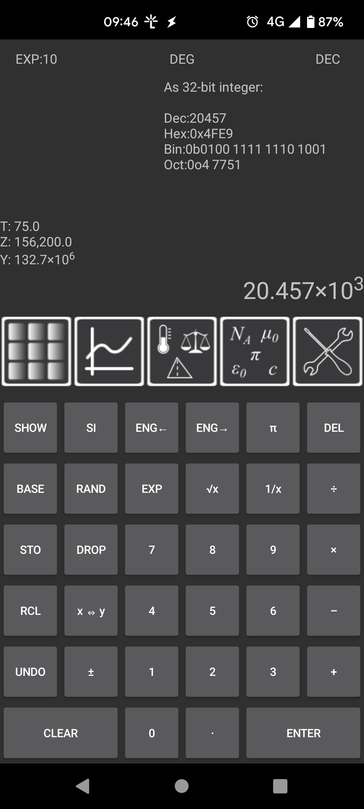
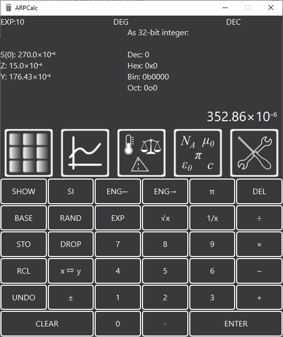
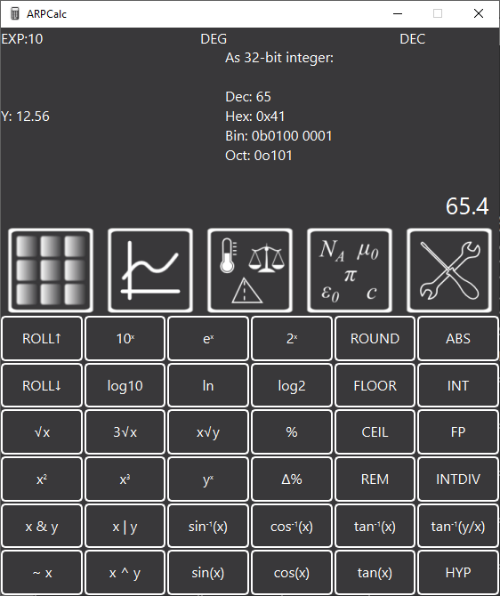
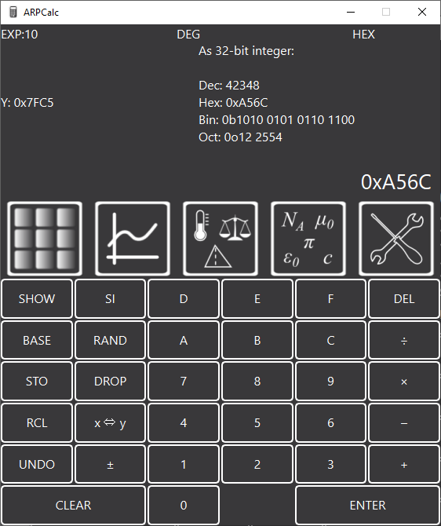
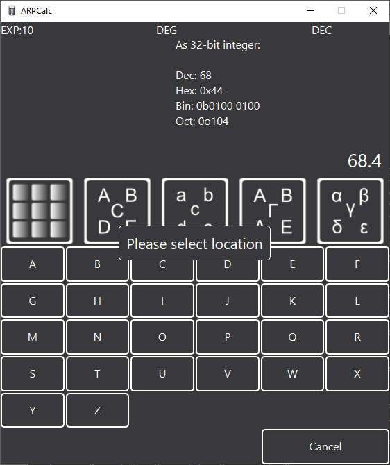
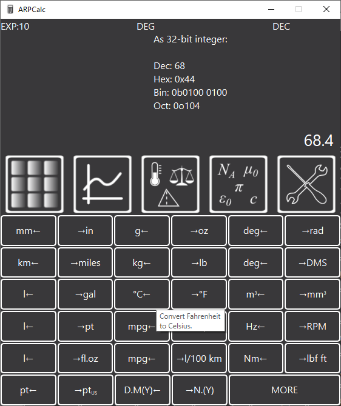
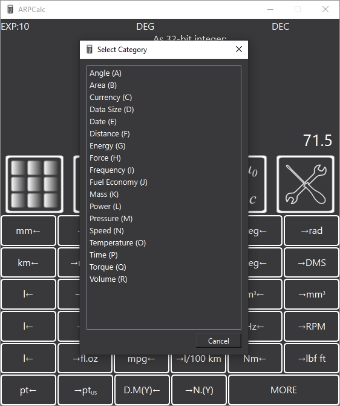
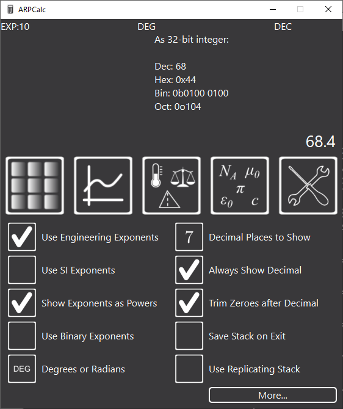
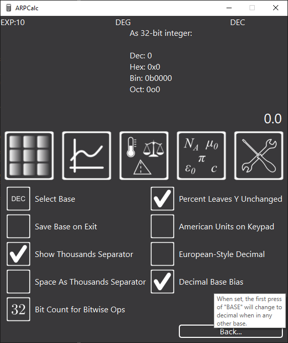

## ARPCalc - Al's Reverse Polish Calculator

### Introduction

I spent a while looking for a decent computer / phone based reverse polish notation (RPN) calculator.  There are a few RPN calculators out there, but I didn't find one I liked.  Most of the mobile phone ones I found tried to emulate a physical calculators, so lots of the functions were crammed into each button and hence the display was cluttered and hard to read.

I've been using this calculator daily since early 2017 so I'm fairly confident it works well.  I've now decided to release it on the website in case others are interested.  Here are a couple of screenshots, one from the Windows version and one from the Android version:

<p align="center">
  
  
</p>

Note that this repository only contains the code for the Windows, Linux and Web Browser based versions; the [Android version](https://github.com/abudden/arpcalc-android) is separate.

For more information, please see [the project website](https://www.cgtk.co.uk/software/arpcalc).

### Features

* Dedicated reverse polish calculator with a simple-to-use interface.
* High precision calculations using arbitrary precision floating point arithmetic.
* Cross platform - Android, Windows, Linux or just [run it in your web browser](http://rpn.cgtk.co.uk).
* Keyboard shortcuts for most common functions for speed of use.
* Engineering format numbers (exponents with powers in multiples of 3).
* Buttons to switch between different engineering prefixes (e.g. 10,400, 10.4&times;10<sup>3</sup>, 0.0104&times;10<sup>6</sup> etc).
* Beautiful formatting of numbers (e.g. 276.3&times;10<sup>-6</sup> or 276.3&nbsp;&micro; instead of 0.0002763 or 2.763e-4).
* Instant conversion between different bases (hexadecimal, binary, octal, decimal).
* Conversion between 175 different units and currencies.
* Quick access to common conversions (as chosen by me!)
* Quick entry of SI prefixes:
	- Press `2` `7` `SI` `p` to enter 27&times;10<sup>-12</sup>
	- On other calculators this would be `2` `7` `EXP` `1` `2` `±` - that method also works in ARPCalc.
	- Keyboard shortcuts make SI units very quick to enter (`2` `7` `Shift-S` `p`).
* 100 memory locations for storing intermediate values.
* Support for binary exponents for maths on bytes (e.g. represent 15,728,640 as 15.0&times;2<sup>20</sup> or 15.0&nbsp;Mi).
* Display of the stack (this is currently only scrollable in the android version).
* Choice of whether to use an "infinite" stack or a four element replicating one (as used on some of the HP calculators).
* Copy / paste values to/from other applications.  The Windows and Linux versions allow copying in a few different formats (either "pretty" text or as values that will be understood by other applications) - right click on the "X" value to see the options.  The Android version only supports copying the value - long press on the "X" value to copy.  It doesn't support paste.  Copying / pasting isn't currently supported in the web browser version.

### Screenshots

Here are a few screenshots from the Windows version of the application to give you an idea of what it looks like and how it works.

<p align="center">
  
  
</p>

The left-hand image above (click for bigger!) shows the main number pad, along with the way that numbers are shown (by default) using engineering notation (with exponents in multiples of 3).  The second image shows the function keypad with various functions for scientific and engineering computation.

<p align="center">
  
  
</p>

The left-hand of these two images shows what the calculator looks like in hexadecimal mode.  The top-right panel shows the X value in all four bases for quick comparison.  The right-hand image shows the view that appears when you press STO (store) or RCL (recall): there are lots of locations to store values in for later use.  Values are saved between sessions.

<p align="center">
  
  
</p>

The left-hand of these two images shows the unit conversion keypad.  The conversions are in pairs so the one that has been hovered over (and hence shows help information) converts to degrees Celsius from degrees Fahrenheit.  The one to the immediate right of the button converts the other way (although I can't understand why anyone would want to convert to degrees Fahrenheit!).

The right-hand image shows the window that appears when you click "More" on the conversions screen (or press `Ctrl-M`).  The conversions are in categories and each category (and unit) has a shortcut key so if there's a conversion you do often, you can learn the key sequence. For example, to convert from cubic centimetres to litres, you press `Ctrl-M`, `R`, `A`, `J`.

<p align="center">
  
  
</p>

These two screenshots show the configuration options available in the application.  If you hover over any option, there's a brief description of what it does.

## Licence

This software is released under the GPL.  See [LICENCE.md](LICENCE.md) for more details.

## Docker Compilation

The release builds are compiled with docker-compose.  A brief explanation of the scripts in the root of the project repository:

* [dkr_seq.sh](dkr_seq.sh): this runs each docker container in turn in order to build the Windows, Linux and Javascript versions of the project.  The same can be done with `docker-compose up`, but that'll build in parallel rather than series.
* [dkr_js.sh](dkr_js.sh): this just runs the docker container that builds the javascript version.
* [build_console.sh](build_console.sh): this is intended for use in msys2 on Windows: it builds the Windows version with the console enabled so that debugging output can be seen.
* [build_release.sh](build_release.sh): this is intended for use in msys2 on Windows: it builds a release version.
* [get_dlls.sh](get_dlls.sh): this tries to find all the DLLs used in the build in order to make a self-contained release.
* [zip_winrelease.sh](zip_winrelease.sh): this zips up the release ready for publication.

To build the docker containers on a Linux system, run `docker-compose build`.  This will take quite a long time as it compiles MXE from scratch (as the MXE repositories don't, at the time of writing, include very recent versions of GCC, upon which this code relies).

## Build Notes for Compilation On Windows

Compiled using MSYS2 on Windows (or via docker cross compilation).

I wrote the following notes while preparing the initial build.  As the libraries are included, compiling it for yourself should be as simple as following steps 1, 2, 7 & 8, but if there are any issues then the intermediate steps might be worth trying.

1. Install http://msys2.github.io/
2. After following the instructions to install it, run the following commands in the MSYS prompt:

```bash
pacman -S base-devel
pacman -S mingw-w64-x86_64-toolchain #for compiling x64 binaries
pacman -S lzip #for extracting gmp
pacman -S mingw-w64-x86_64-qt6-static mingw-w64-x86_64-qt6-tools
pacman -S mingw-w64-x86_64-openssl
pacman -S mingw-w64-x86_64-libzip
```

3. Download gmp-6.2.1 and mpfr-4.1.0
4. Extract gmp and mpfr into the libs directory:

```bash
cd libs
tar --lzip -xvf /path/to/gmp-*.tar.lz
tar -xf /path/to/mpfr-*.tar.bz2
```

5. Open the MSYS2 64bit/MinGW 64-bit terminal
6. Compile GMP and MPFR (after fixing the paths appropriately below):

```bash
cd libs/gmp-6.2.1
./configure --enable-static --disable-shared \
	--prefix=/c/Users/asbmi/Documents/calculators/calclib/libs/x64 \
	&& make clean && make 2>&1 | tee build.log && make check && make install

cd ../mpfr-4.1.0/
./configure --enable-static --disable-shared --enable-thread-safe \
	--with-gmp=/c/Users/asbmi/Documents/calculators/calclib/libs/x64 \
	--prefix=/c/Users/asbmi/Documents/calculators/calclib/libs/x64 \
	&& make clean && make 2>&1 | tee build.log && make check && make install
```

7. Build the project

```bash
qmake-qt6.exe && make clean && make 2>&1
```

8. Get the DLLs etc into the release folder:

```bash
bash get_dlls.sh
```
<!-- vim: set ft=pandoc : -->
